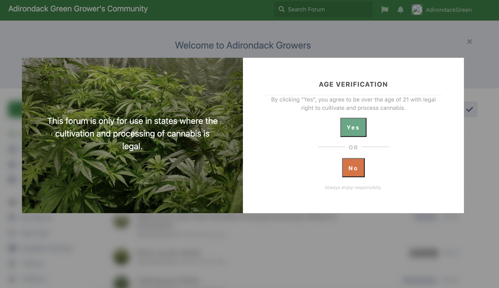

# Age Checker for Flarum

 [](https://packagist.org/packages/webbinaro/flarum-age-check) [](https://packagist.org/packages/webbinaro/flarum-age-check)

A [Flarum](http://flarum.org) extension that blurs out any site content until the user accepts a legal disclaimer that you configure in the UI.



## Installation

Install with composer:

```sh
composer require webbinaro/flarum-age-check:"*"
```

## Updating

```sh
composer update webbinaro/flarum-age-check:"*"
php flarum migrate
php flarum cache:clear
```

## Links

- [Packagist](https://packagist.org/packages/webbinaro/flarum-age-check)
- [GitHub](https://github.com/webbinaro/flarum-age-check)
- [Discuss](https://discuss.flarum.org/d/29656-age-checker-age-verification-for-flarum-forum)
